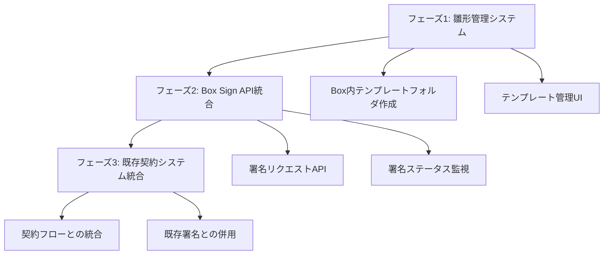

# Box Sign実装時の影響範囲分析

## 概要

本ドキュメントは、現在稼働中の土木設計業務プラットフォームにBox Sign電子署名機能を実装する際の影響範囲とリスクを分析したものです。

## 実装予定機能

- **発注書の電子署名**: 雛形からの自動生成と署名フロー
- **完了届の電子署名**: プロジェクト完了時の電子署名
- **請求書の電子署名**: 請求書作成と承認の電子化
- **雛形管理システム**: Box内での書類テンプレート管理

---

## 影響範囲分析

### 🔴 **高リスク - 直接影響を受けるファイル**

#### 1. Box API関連ファイル

| ファイル | 影響内容 | 対応方法 |
|---------|----------|----------|
| `/src/lib/box.ts` | Box Sign API関数の追加が必要 | 既存関数を保持し、新しいSign関数を追加 |
| `/src/app/api/box/projects/route.ts` | 署名書類管理API追加 | 新しいエンドポイントを並行追加 |

**既存機能への影響**:
- ✅ 既存のBox認証・フォルダ管理機能は変更なし
- ⚠️ Box Sign API用の新しいOAuthスコープ追加が必要

#### 2. 契約管理システム

| ファイル | 現在の機能 | 追加機能 | 影響度 |
|---------|------------|----------|--------|
| `/src/app/contracts/page.tsx` | 手動署名管理 | Box Sign統合UI | 中 |

**既存の署名フィールド**:
- `contractor_signed_at`: 受注者署名日時
- `org_signed_at`: 発注者署名日時
- `signed_at`: 契約完了日時

**対応方針**: 既存の手動署名フローと並行してBox Sign機能を提供

---

### 🟡 **中リスク - 間接影響を受ける可能性**

#### 3. データベーススキーマ拡張

**新規テーブル追加**:

```sql
-- 書類テンプレート管理
CREATE TABLE document_templates (
  id UUID PRIMARY KEY DEFAULT gen_random_uuid(),
  name VARCHAR NOT NULL,
  type VARCHAR NOT NULL, -- 'order', 'completion', 'invoice'
  box_file_id VARCHAR NOT NULL,
  template_fields JSONB, -- 自動入力フィールド定義
  is_active BOOLEAN DEFAULT true,
  created_at TIMESTAMP DEFAULT NOW()
);

-- Box Sign署名リクエスト管理
CREATE TABLE box_sign_requests (
  id UUID PRIMARY KEY DEFAULT gen_random_uuid(),
  project_id UUID REFERENCES projects(id),
  contract_id UUID REFERENCES contracts(id),
  template_id UUID REFERENCES document_templates(id),
  box_sign_request_id VARCHAR NOT NULL, -- Box側のID
  document_type VARCHAR NOT NULL,
  status VARCHAR NOT NULL, -- 'pending', 'signed', 'declined', 'expired'
  signers JSONB NOT NULL, -- 署名者情報
  signed_document_id VARCHAR, -- 署名完了後のBox file ID
  created_at TIMESTAMP DEFAULT NOW(),
  completed_at TIMESTAMP
);

-- 署名履歴管理
CREATE TABLE document_signatures (
  id UUID PRIMARY KEY DEFAULT gen_random_uuid(),
  sign_request_id UUID REFERENCES box_sign_requests(id),
  signer_email VARCHAR NOT NULL,
  signer_role VARCHAR NOT NULL, -- 'client', 'contractor'
  signed_at TIMESTAMP,
  ip_address INET,
  user_agent TEXT
);
```

**既存テーブル拡張**:

```sql
-- contracts テーブル拡張
ALTER TABLE contracts
ADD COLUMN box_sign_request_id VARCHAR,
ADD COLUMN digital_signature_enabled BOOLEAN DEFAULT false;

-- projects テーブル拡張（必要に応じて）
ALTER TABLE projects
ADD COLUMN order_document_template_id UUID REFERENCES document_templates(id),
ADD COLUMN completion_document_template_id UUID REFERENCES document_templates(id);
```

#### 4. プロジェクト管理システム

| ファイル | 追加機能 | 既存機能への影響 |
|---------|----------|------------------|
| `/src/app/projects/page.tsx` | 書類作成ボタン追加 | なし（UI拡張のみ） |
| `/src/app/project-files/page.tsx` | 署名済み書類表示 | なし（表示項目追加のみ） |

---

### 🟢 **低リスク - 影響最小**

#### 5. 認証・権限システム
- 既存のBox認証システムを継続使用
- 追加のOAuthスコープ設定のみ必要：
  - `box_sign:manage` - 署名リクエスト作成・管理
  - `box_sign:read` - 署名ステータス確認

#### 6. ファイル管理システム
- 既存のアップロード・ダウンロード機能は完全に保持
- 署名済み書類も通常ファイルとして管理継続

---

## リスク軽減戦略

### 1. 段階的実装アプローチ



### 2. 既存機能保護メカニズム

#### フィーチャーフラグ実装
```typescript
// 新機能の有効/無効を制御
const FEATURE_FLAGS = {
  BOX_SIGN_ENABLED: process.env.NEXT_PUBLIC_BOX_SIGN_ENABLED === 'true',
  DIGITAL_SIGNATURE_REQUIRED: process.env.DIGITAL_SIGNATURE_REQUIRED === 'true'
}

// 既存フローとの併用
function getSignatureMethod(contractId: string) {
  if (FEATURE_FLAGS.BOX_SIGN_ENABLED && isBoxSignEnabled(contractId)) {
    return 'digital'
  }
  return 'manual' // 既存の手動署名フロー
}
```

#### APIバージョニング
```
既存API: /api/contracts/* (変更なし)
新規API: /api/contracts/v2/* (Box Sign対応)
署名API: /api/box/sign/* (新規)
```

### 3. データ整合性保証

#### 外部キー制約とトランザクション管理
```sql
-- 契約とBox Sign署名の整合性
ALTER TABLE box_sign_requests
ADD CONSTRAINT check_contract_or_project
CHECK (
  (contract_id IS NOT NULL AND project_id IS NULL) OR
  (contract_id IS NULL AND project_id IS NOT NULL)
);

-- 署名完了時の自動更新
CREATE OR REPLACE FUNCTION update_contract_signature()
RETURNS TRIGGER AS $$
BEGIN
  IF NEW.status = 'signed' AND OLD.status != 'signed' THEN
    UPDATE contracts
    SET
      signed_at = NEW.completed_at,
      org_signed_at = NEW.completed_at
    WHERE id = NEW.contract_id;
  END IF;
  RETURN NEW;
END;
$$ LANGUAGE plpgsql;

CREATE TRIGGER trigger_update_contract_signature
  AFTER UPDATE ON box_sign_requests
  FOR EACH ROW EXECUTE FUNCTION update_contract_signature();
```

### 4. エラーハンドリング・フォールバック

```typescript
async function createSignatureRequest(contractData: ContractData) {
  try {
    // Box Sign API呼び出し
    const signRequest = await boxSignAPI.createRequest(contractData)
    return { success: true, signRequest }
  } catch (error) {
    // Box Sign失敗時は手動署名フローにフォールバック
    console.warn('Box Sign failed, falling back to manual signature:', error)
    return {
      success: false,
      fallback: 'manual',
      message: 'デジタル署名に失敗しました。手動署名をご利用ください。'
    }
  }
}
```

---

## 安全実装のチェックポイント

### ✅ 実装前確認事項

1. **既存機能の動作確認**
   - [ ] Box認証フローが正常動作
   - [ ] プロジェクトファイル管理が正常動作
   - [ ] 現在の契約管理フローが正常動作
   - [ ] Box API連携が正常動作

2. **環境設定確認**
   - [ ] Box Sign APIキー取得・設定
   - [ ] OAuth スコープ拡張
   - [ ] 開発・ステージング環境での動作確認

3. **データベース準備**
   - [ ] 新規テーブル作成スクリプト準備
   - [ ] データマイグレーション計画策定
   - [ ] バックアップ・ロールバック手順確認

### ✅ 実装中確認事項

1. **新機能開発**
   - [ ] フィーチャーフラグによる機能切り替えテスト
   - [ ] 既存APIエンドポイント無変更確認
   - [ ] 新規APIエンドポイント単体テスト

2. **統合テスト**
   - [ ] 既存機能と新機能の並行動作確認
   - [ ] Box Sign無効時の既存フロー動作確認
   - [ ] エラー時のフォールバック動作確認

### ✅ リリース前確認事項

1. **機能テスト**
   - [ ] エンドツーエンド署名フローテスト
   - [ ] 複数署名者での署名順序テスト
   - [ ] 署名キャンセル・期限切れハンドリング

2. **パフォーマンステスト**
   - [ ] 既存機能のレスポンス時間劣化なし
   - [ ] Box Sign API呼び出し時のタイムアウト設定
   - [ ] 大量署名リクエスト処理能力確認

---

## 想定される追加開発工数

| 項目 | 想定工数 | 優先度 |
|------|----------|--------|
| 雛形管理システム | 3-5日 | 高 |
| Box Sign API統合 | 5-7日 | 高 |
| 署名フローUI開発 | 4-6日 | 高 |
| 既存システム統合 | 3-5日 | 中 |
| テスト・デバッグ | 5-7日 | 高 |
| **合計** | **20-30日** | - |

---

## 結論

**Box Sign統合は段階的実装により既存機能への影響を最小限に抑えながら実現可能**

### 主要メリット
- 📄 書類作成・署名の完全自動化
- 🔒 法的効力のある電子署名
- 📊 署名進捗の可視化・管理
- 🗂️ Box内での一元的な書類管理

### リスク対策
- 🔧 フィーチャーフラグによる段階的ロールアウト
- 🔄 既存手動フローとの併用
- 🛡️ 自動フォールバック機能
- 📋 包括的なテスト戦略

この分析に基づき、**安全で効率的なBox Sign統合実装が可能**と判断されます。

---

**作成日**: 2025年9月24日
**作成者**: Claude Code Assistant
**ドキュメント版数**: v1.0